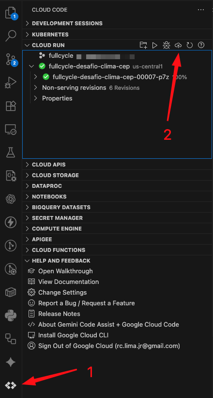
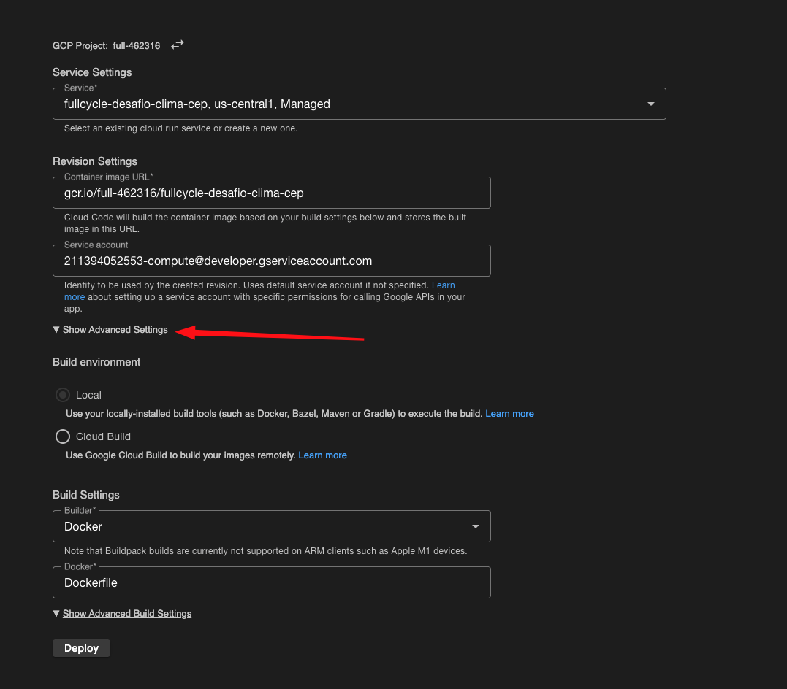
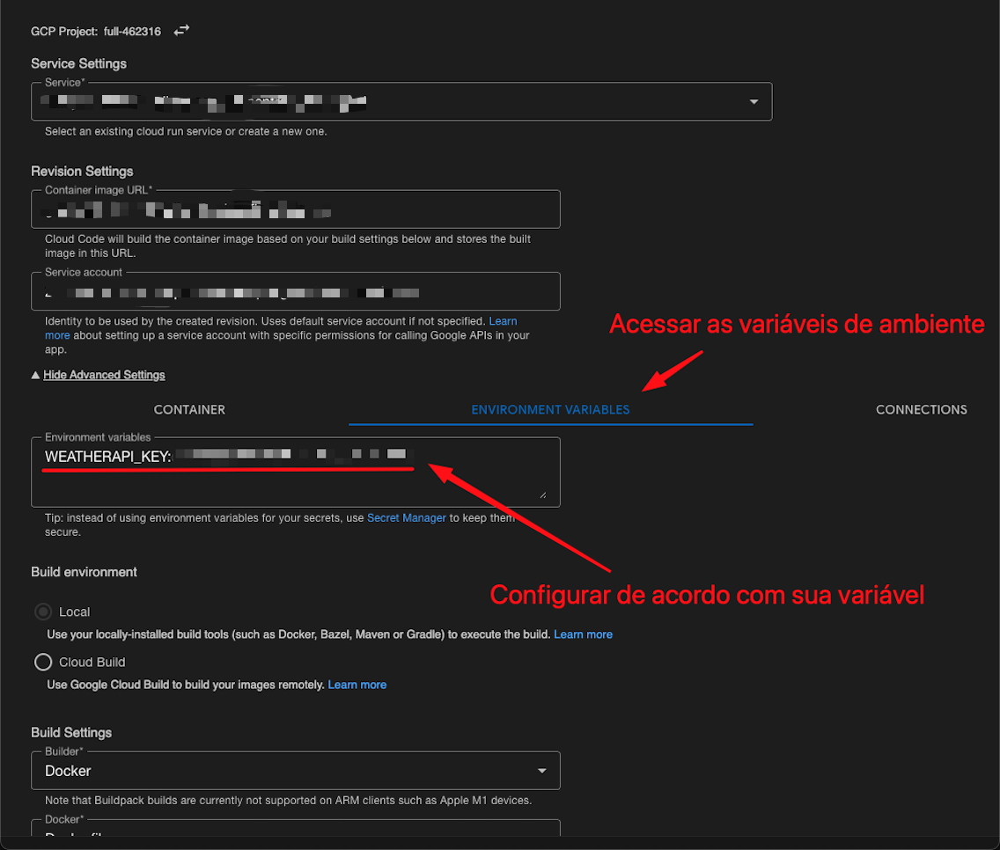

# fullcycle-desafio-clima-cep

## OBS: TESTE VIA TERMINAL
```curl https://fullcycle-desafio-clima-cep-211394052553.us-central1.run.app/weather/01001000```

## Desafio:
**Objetivo:** Desenvolver um sistema em Go que receba um CEP, identifica a cidade e retorna o clima atual (temperatura em graus celsius, fahrenheit e kelvin). Esse sistema deverá ser publicado no Google Cloud Run.

## Requisitos:
- O sistema deve receber um CEP válido de 8 digitos
- O sistema deve realizar a pesquisa do CEP e encontrar o nome da localização, a partir disso, deverá retornar as temperaturas e formata-lás em: Celsius, Fahrenheit, Kelvin.
- O sistema deve responder adequadamente nos seguintes cenários:
    - Em caso de sucesso:
        - Código HTTP: **200**
        - Response Body: ```{ "temp_C": 28.5, "temp_F": 28.5, "temp_K": 28.5 }```
    - Em caso de falha, caso o CEP não seja válido (com formato correto):
        - Código HTTP: **422**
        - Mensagem: **invalid zipcode**
    - Em caso de falha, caso o CEP não seja encontrado:
        - Código HTTP: **404**
        - Mensagem: **can not find zipcode**
    - Deverá ser realizado o deploy no Google Cloud Run.


## Dicas:
- Utilize a API viaCEP (ou similar) para encontrar a localização que deseja consultar a temperatura: https://viacep.com.br/
- Utilize a API WeatherAPI (ou similar) para consultar as temperaturas desejadas: https://www.weatherapi.com/
- Para realizar a conversão de Celsius para Fahrenheit, utilize a seguinte fórmula: ```F = C * 1,8 + 32```
- Para realizar a conversão de Celsius para Kelvin, utilize a seguinte fórmula: ```K = C + 273```
    - Sendo F = Fahrenheit
    - Sendo C = Celsius
    - Sendo K = Kelvin


## Entrega:
- O código-fonte completo da implementação.
- Testes automatizados demonstrando o funcionamento.
- Utilize docker/docker-compose para que possamos realizar os testes de sua aplicação.
- Deploy realizado no Google Cloud Run (free tier) e endereço ativo para ser acessado.

# Instruções:

Local e via Cloud Run

## Local
1. Clonar o Repositório:
```
git clone git@github.com:robertocorreajr/fullcycle-desafio-clima-cep.git
cd fullcycle-desafio-clima-cep
```

2. Crie um arquivo ```.env``` com as variáveis de ambiente necessárias
```
cp .env.example .env
```

3. Obtenha uma chave válida da WeatherAPI
    1. Acesse [weatherapi.com](https://www.weatherapi.com)
    2. Crie uma conta gratuita
    3. Obtenha sua chave API 


4. Edite o arquivo ```.env``` e adicione a sua chave da API.
```
WEATHERAPI_KEY=sua_chave_aqui
PORT=8080
```

5. Construa as imagens e suba o container:
```
docker-compose build
docker-compose up -d
```

6. Teste a aplicação
Agora você pode testar a aplicação com:
```
curl http://localhost:8080/weather/01001000
```

7. Para parar a aplicação
```
docker-compose down
```

## Cloud Run
1. Ter instalada e configurada a extenção Google Cloud Code

2. Acessar a extensão e selecionar Cloud Run


3. Configurar as variáveis de ambiente como segue...

    Expamdir as configurações avançadas
    

    Configurar as variáveis de ambiente
    

4. Depois basta clicar em Deploy e aguardar.

5. Teste
    - Possivel testar via terminal:
        ```curl https://fullcycle-desafio-clima-cep-211394052553.us-central1.run.app/weather/01001000```